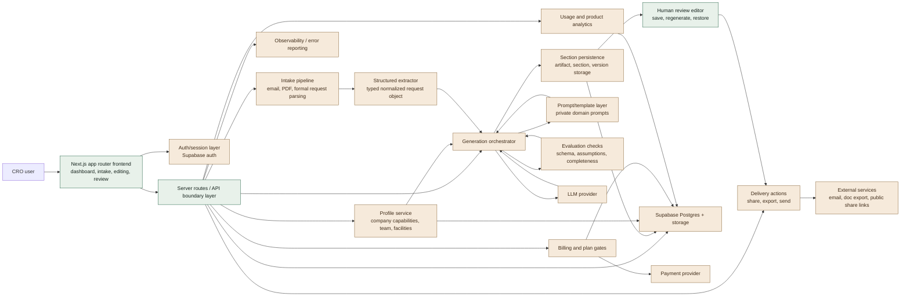

# Architecture Overview

This is a sanitized description of the architecture behind the original commercial product. It is meant to demonstrate system design and engineering judgment without exposing the original domain logic, prompt IP, or database schema in full.

## System shape

The original product followed a split between four concerns:

1. Request intake
2. Structured normalization
3. Sectioned generation workflows
4. Human review and delivery

The core product idea was not "send one big prompt and hope." The architecture was designed so each stage had a distinct contract and could fail, retry, or regenerate independently.

## Full system diagram

The diagram below includes both the public-safe parts still present in this repository and the private layers that were intentionally removed before publishing.



### Reading the diagram

- Green nodes represent the public-safe shape still reflected in this repo.
- Sand nodes represent private implementation layers that were removed before publishing.
- The important architectural point is the boundary design, not the exact vendor or prompt contents.

## High-level flow

```text
User input
  -> Intake service
  -> Structured extractor
  -> Normalized request object
  -> Section/job planner
  -> Independent generation tasks
  -> Persistence layer
  -> Human editing/review UI
  -> Delivery/export/share actions
```

## Key architectural decisions

### 1. Normalize first, generate second

Unstructured source material was parsed into a typed intermediate object before any drafting work began.

Reasoning:

- generation quality improves when prompts consume stable structure instead of raw noisy text
- downstream steps become testable
- missing information can be surfaced explicitly instead of being hallucinated

### 2. Store generated units separately

Generated outputs were stored as separate units instead of a single large blob.

Reasoning:

- individual sections can be regenerated without destroying the full result
- version history is easier to manage
- future content reuse becomes possible
- failures stay localized

### 3. Keep high-risk fields human-controlled

Some fields should remain manual by design.

Reasoning:

- commercial and compliance risk is concentrated in a small number of fields
- AI assistance is strongest when it accelerates drafting, not when it takes irreversible decisions away from users

### 4. Separate orchestration from prompt content

The execution path and the prompt templates were treated as different concerns.

Reasoning:

- prompt iteration should not require rewriting API flow code
- orchestration logic is easier to test when prompts are isolated
- sensitive prompt IP can be replaced or withheld without collapsing the app structure

## API boundary design

The original product used narrow server routes rather than one broad "do everything" endpoint.

Representative boundary pattern:

```text
POST /api/intake/analyze
  input: raw source material
  output: normalized request object

POST /api/proposal/generate
  input: normalized request object + profile context
  output: persisted generation jobs / generated sections

POST /api/proposal/regenerate-section
  input: proposal id + section id
  output: a newly generated replacement for one section

PATCH /api/proposal/section
  input: section content edits
  output: persisted human-reviewed section
```

That shape matters because it reflects product intent:

- intake is not the same responsibility as generation
- regeneration should be targeted
- user edits should not go back through the full AI pipeline

## Public vs removed layers

What remains in this repository:

- frontend positioning and information architecture
- sanitized workflow and eval documentation
- typed public-facing structure
- a clear explanation of orchestration boundaries

What was removed before publishing:

- live route handlers
- prompt bodies and prompt composition logic
- storage schema and migrations
- provider credentials and environment bindings
- commercial features like billing, referrals, exports, and sharing
- domain-specific workflow details that would reveal the product's moat

## Persistence model

The persistence strategy was built around recoverability and partial updates.

Core entities looked roughly like:

- organization/profile
- incoming request
- generated artifact
- generated section
- section version

This model supports:

- partial saves
- per-section regeneration
- version restores
- future analytics and reuse features

## LLM workflow design

The original implementation treated LLM usage as a pipeline, not a single completion.

Common stages:

1. Extract facts into typed structure
2. Generate bounded content units
3. Validate shape and obvious policy constraints
4. Persist outputs independently
5. Let the human edit before final delivery

## Evaluation strategy

The eval strategy was practical rather than research-oriented. The point was to catch failure modes that would create user distrust or commercial risk.

Primary eval classes:

- schema conformance
- unsupported assumptions
- missing-critical-input detection
- section isolation and recoverability
- style/tone consistency

## Why this matters in a portfolio repo

A public repo does not need to expose the exact product internals to demonstrate strong engineering. What usually matters to interviewers is whether the architecture shows:

- correct decomposition
- sane boundaries
- failure-aware design
- maintainability under iteration
- evidence that AI was integrated as a system, not as a gimmick

That is the purpose of this sanitized architecture note.
