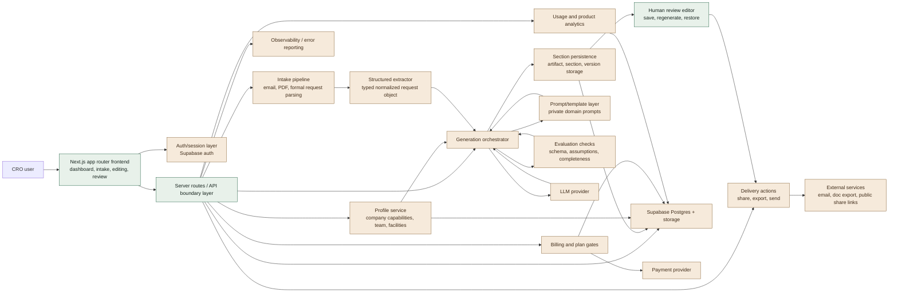

# Sanitized AI Product Showcase

This repository is a public-safe cut of a real commercial AI product.

It is intentionally not the full application. The original product includes private workflows, domain-specific prompts, commercial logic, internal operating documents, and other product IP that should not be published in a public repository.

## What this repo keeps

- A polished Next.js frontend shell
- Product framing and UX direction
- Sanitized examples of AI workflow decomposition
- Sanitized examples of evaluation design
- A sanitized architecture overview and API design notes
- TypeScript structure suitable for a public portfolio repo

## What was removed

- Proprietary prompts and prompt chains
- Commercial business logic
- Live API routes and backend integrations
- Database schema and migrations
- Billing, export, referral, and sharing flows
- Internal planning docs and local development artifacts
- Customer-like sample material and private environment files

## Why this exists

The goal is to showcase how I build products with LLMs without handing over the monetizable core of the underlying business. This version demonstrates:

- product thinking
- frontend execution
- architecture and system decomposition
- API and workflow boundary design
- workflow decomposition for LLM tasks
- eval design for structured generation systems

## Local development

```bash
npm install
npm run dev
```

Then open [http://localhost:3000](http://localhost:3000).

## Architecture overview

This is a sanitized description of the architecture behind the original commercial product. It is meant to demonstrate system design and engineering judgment without exposing the original domain logic, prompt IP, or database schema in full.

### System shape

The original product followed a split between four concerns:

1. Request intake
2. Structured normalization
3. Sectioned generation workflows
4. Human review and delivery

The core product idea was not "send one big prompt and hope." The architecture was designed so each stage had a distinct contract and could fail, retry, or regenerate independently.

### Full system diagram

The diagram below includes both the public-safe parts still present in this repository and the private layers that were intentionally removed before publishing.



Reading the diagram:

- Green nodes represent the public-safe shape still reflected in this repo.
- Sand nodes represent private implementation layers that were removed before publishing.
- The important architectural point is the boundary design, not the exact vendor or prompt contents.

### High-level flow

```text
User input
  -> Intake service
  -> Structured extractor
  -> Normalized request object
  -> Section/job planner
  -> Independent generation tasks
  -> Persistence layer
  -> Human editing/review UI
  -> Delivery/export/share actions
```

### Key architectural decisions

#### 1. Normalize first, generate second

Unstructured source material was parsed into a typed intermediate object before any drafting work began.

Reasoning:

- generation quality improves when prompts consume stable structure instead of raw noisy text
- downstream steps become testable
- missing information can be surfaced explicitly instead of being hallucinated

#### 2. Store generated units separately

Generated outputs were stored as separate units instead of a single large blob.

Reasoning:

- individual sections can be regenerated without destroying the full result
- version history is easier to manage
- future content reuse becomes possible
- failures stay localized

#### 3. Keep high-risk fields human-controlled

Some fields should remain manual by design.

Reasoning:

- commercial and compliance risk is concentrated in a small number of fields
- AI assistance is strongest when it accelerates drafting, not when it takes irreversible decisions away from users

#### 4. Separate orchestration from prompt content

The execution path and the prompt templates were treated as different concerns.

Reasoning:

- prompt iteration should not require rewriting API flow code
- orchestration logic is easier to test when prompts are isolated
- sensitive prompt IP can be replaced or withheld without collapsing the app structure

### API boundary design

The original product used narrow server routes rather than one broad "do everything" endpoint.

Representative boundary pattern:

```text
POST /api/intake/analyze
  input: raw source material
  output: normalized request object

POST /api/proposal/generate
  input: normalized request object + profile context
  output: persisted generation jobs / generated sections

POST /api/proposal/regenerate-section
  input: proposal id + section id
  output: a newly generated replacement for one section

PATCH /api/proposal/section
  input: section content edits
  output: persisted human-reviewed section
```

That shape matters because it reflects product intent:

- intake is not the same responsibility as generation
- regeneration should be targeted
- user edits should not go back through the full AI pipeline

### Public vs removed layers

What remains in this repository:

- frontend positioning and information architecture
- sanitized workflow and eval documentation
- typed public-facing structure
- a clear explanation of orchestration boundaries

What was removed before publishing:

- live route handlers
- prompt bodies and prompt composition logic
- storage schema and migrations
- provider credentials and environment bindings
- commercial features like billing, referrals, exports, and sharing
- domain-specific workflow details that would reveal the product's moat

### Persistence model

The persistence strategy was built around recoverability and partial updates.

Core entities looked roughly like:

- organization/profile
- incoming request
- generated artifact
- generated section
- section version

This model supports:

- partial saves
- per-section regeneration
- version restores
- future analytics and reuse features

### LLM workflow design

The original implementation treated LLM usage as a pipeline, not a single completion.

Common stages:

1. Extract facts into typed structure
2. Generate bounded content units
3. Validate shape and obvious policy constraints
4. Persist outputs independently
5. Let the human edit before final delivery

### Evaluation strategy

The eval strategy was practical rather than research-oriented. The point was to catch failure modes that would create user distrust or commercial risk.

Primary eval classes:

- schema conformance
- unsupported assumptions
- missing-critical-input detection
- section isolation and recoverability
- style/tone consistency

## Case study

### Project

Sanitized AI product showcase derived from a real commercial web application.

### The problem

The original product solved a high-friction commercial workflow where users had to respond to messy incoming requests quickly, but with enough precision that bad output would create direct business risk.

This created a difficult engineering constraint:

- inputs were unstructured
- outputs needed to feel professional and usable
- some parts could be AI-assisted
- some parts had to remain under explicit human control
- the whole workflow needed to be fast enough to matter commercially

### My role

This project reflects end-to-end product engineering work:

- product framing
- system design
- frontend UX and workflow design
- AI orchestration
- evaluation design
- persistence model thinking

### Core design choices

#### 1. Treat AI as a pipeline, not a button

The system was designed around stages:

1. intake
2. normalization
3. bounded generation
4. validation
5. human review
6. delivery

That choice made the product more reliable and made failures easier to isolate.

#### 2. Separate normalization from generation

One of the biggest practical mistakes in AI products is asking the model to understand messy input and generate polished output in the same step.

I split those responsibilities. First produce a normalized structured object. Then use that structure to drive generation.

Benefits:

- better prompt stability
- easier testing
- better visibility into missing information
- safer downstream automation

#### 3. Store outputs in smaller units

Instead of storing one giant generated blob, the architecture was designed around independently stored content units and versions.

Benefits:

- targeted regeneration
- partial saves
- easier auditing
- future reuse paths

#### 4. Keep humans in the high-risk path

Not everything should be AI-generated. Where the commercial or compliance risk was high, the product deliberately left editing and control with the user.

That was not a limitation. It was a product decision.

### Technical challenges

#### Unstructured input quality

Incoming source material could be incomplete, inconsistent, or badly formatted. The system needed a stable intermediate representation before generation could be trusted.

#### Recoverability

If one generated unit failed, users still needed a usable draft. The architecture could not treat generation as all-or-nothing.

#### Product trust

Users do not care whether the model is impressive. They care whether the system is dependable and whether they can correct it quickly when it gets something wrong.

### Evaluation approach

The evaluation strategy focused on operational failure modes rather than benchmark vanity metrics.

Primary checks included:

- schema conformance
- unsupported assumptions
- missing-critical-input detection
- recoverability of partial failures
- consistency across independently generated sections

### Why the public repo is sanitized

The original app is a real commercial product. Publishing the exact prompts, schema, workflow logic, and monetizable backend would weaken the business.

So this repository is designed to show the engineering quality without revealing the moat.

That means the interviewer can still inspect:

- how the system was decomposed
- how the UX was framed
- how AI task boundaries were defined
- how evals were used pragmatically

### What I would highlight in an interview

- I do not bolt LLMs onto products casually; I design around failure modes.
- I bias toward architectures that preserve recoverability and iteration speed.
- I think about user trust and business risk at the same time as implementation.
- I know when to automate and when not to.

## Notes

- This repository is intentionally static and sanitized.
- The original product used live integrations and private prompts that are not included here.
- If you want the repo name and copy updated for a specific portfolio angle, that can be done as a follow-up pass.
